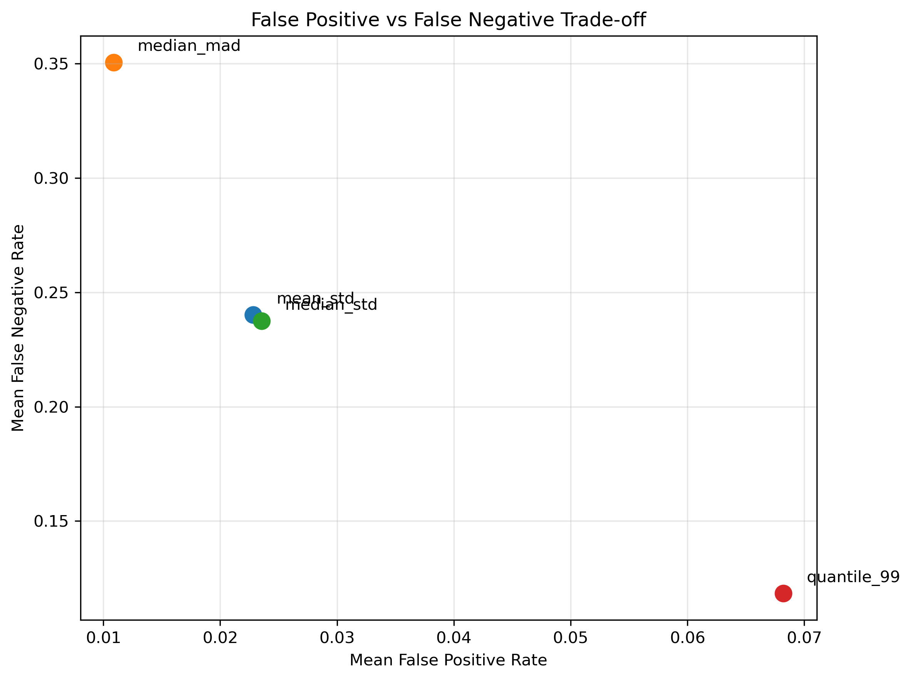
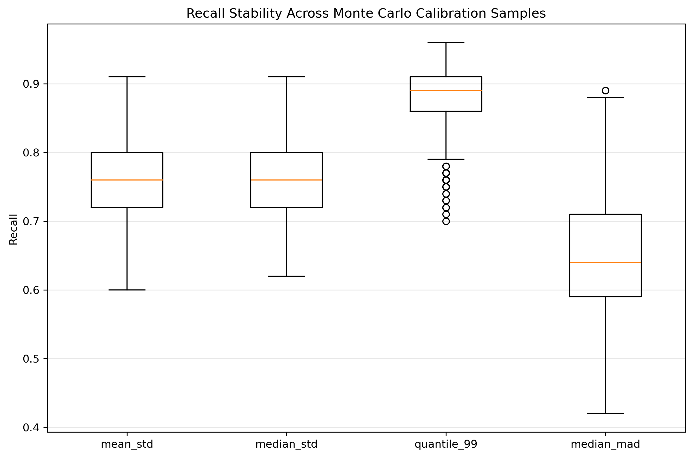
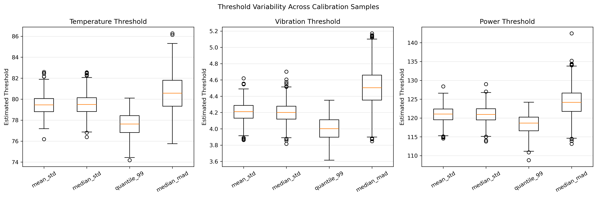
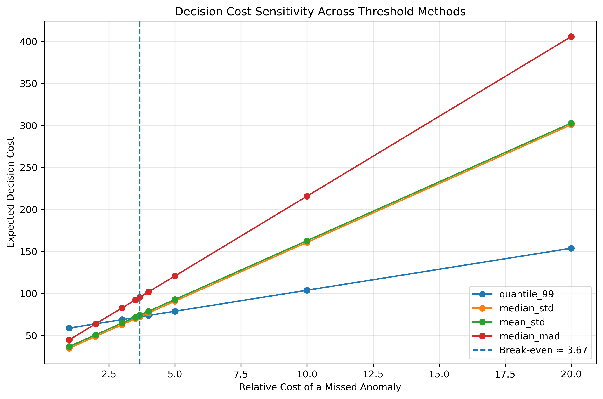

# Sensor Anomaly Risk Evaluation Using Monte Carlo Simulation

This project evaluates how sampling variability affects sensor anomaly thresholds and downstream operational risk.

Using fully synthetic IoT sensor data, multiple thresholding methods are compared across repeated calibration samples. Monte Carlo resampling is used to measure threshold stability, false-alarm risk, missed-anomaly risk, and cost-sensitive decision performance.

## Overview

Sensor monitoring systems often rely on alert thresholds derived from historical normal-operation data.

However, these thresholds can vary depending on which calibration samples are used. That variability can lead to different operational outcomes, including:

- unnecessary false alarms
- missed anomalies
- unstable detection performance
- different downstream decision costs

This project investigates how different threshold estimation methods behave under calibration-sampling uncertainty.

## Problem

The analysis focuses on three questions:

1. How sensitive are sensor alert thresholds to calibration sampling?
2. How do different thresholding methods trade off false positives and false negatives?
3. How does the preferred thresholding strategy change when missed anomalies are more costly than false alarms?

## Synthetic Dataset

The project uses a fully synthetic IoT sensor dataset with three correlated metrics:

- Temperature
- Vibration
- Power

Each observation also contains a ground-truth label:

- `0` = normal operation
- `1` = anomaly

The complete synthetic dataset contains:

- 500 normal observations
- 100 anomaly observations
- 600 total observations

The sensor metrics are generated with correlation to better represent multivariate operating behavior.

## Calibration and Evaluation

A calibration sample of 60 known-normal observations is used to estimate alert thresholds.

The remaining data is used as an evaluation population:

- 440 normal observations
- 100 anomaly observations

An alert is triggered when **any sensor metric exceeds its estimated threshold**.

## Threshold Methods

Four threshold estimation approaches are compared.

### Mean + Standard Deviation

\[
T = \bar{x} + 2.5s
\]

### Median + Standard Deviation

\[
T = \text{median}(x) + 2.5s
\]

### 99th Percentile

\[
T = Q_{0.99}(x)
\]

### Median + MAD

\[
T = \text{median}(x) + 3 \times 1.4826 \times MAD
\]

where MAD is the median absolute deviation.

## Single Calibration Example

Using one 60-observation calibration sample produced the following detection performance:

| Method | False Positive Rate | False Negative Rate | Precision | Recall |
|---|---:|---:|---:|---:|
| Mean + SD | 5.23% | 14.00% | 78.90% | 86.00% |
| Median + SD | 4.77% | 14.00% | 80.37% | 86.00% |
| 99th Percentile | 12.27% | 5.00% | 63.76% | 95.00% |
| Median + MAD | 5.91% | 19.00% | 75.70% | 81.00% |

The 99th-percentile method achieved the highest recall, but generated substantially more false alarms.

## Monte Carlo Stability Analysis

To evaluate calibration uncertainty, the calibration process is repeated **1,000 times**.

For each iteration:

1. 60 normal observations are randomly selected as the calibration set.
2. Thresholds are estimated using all four methods.
3. The thresholds are applied to the remaining evaluation population.
4. False positive rate, false negative rate, precision, recall, and threshold values are recorded.

This produces 4,000 method-iteration results.

## Monte Carlo Results

### Detection Performance

Average results across Monte Carlo iterations:

| Method | Mean FPR | Mean FNR | Mean Precision | Mean Recall |
|---|---:|---:|---:|---:|
| Mean + SD | 2.28% | 24.02% | 88.90% | 75.98% |
| Median + SD | 2.35% | 23.74% | 88.65% | 76.25% |
| 99th Percentile | 6.82% | 11.84% | 75.82% | 88.16% |
| Median + MAD | 1.09% | 35.05% | 94.12% | 64.95% |

The results demonstrate a clear operating trade-off:

- The **99th-percentile method** detects more anomalies but creates more false alarms.
- The **Median + MAD method** minimizes false alarms but misses substantially more anomalies.
- The **Mean + SD** and **Median + SD** methods provide more balanced operating behavior.

## Threshold Stability

Monte Carlo resampling also reveals differences in threshold stability across methods.

For example, the standard deviation of the estimated temperature threshold was approximately:

- Mean + SD: **0.94**
- Median + SD: **1.02**
- 99th Percentile: **1.12**
- Median + MAD: **1.72**

Although MAD-based estimators are often considered robust to outliers, this experiment shows that robustness to outliers does not necessarily imply lower sampling variability in every calibration setting.

## False Positive vs False Negative Trade-off



The 99th-percentile threshold occupies the low-FNR / high-FPR region, while the Median + MAD approach shows the opposite behavior.

This highlights that threshold selection is not simply a matter of maximizing one detection metric.

## Recall Stability



Recall varies across calibration samples, demonstrating that anomaly detection performance depends not only on the thresholding rule but also on sampling uncertainty.

## Threshold Variability



The threshold distributions show how different estimators respond to repeated calibration sampling.

## Cost-Sensitive Risk Analysis

Operationally, false positives and false negatives may not have equal consequences.

The project therefore defines a simple synthetic decision-cost function:

\[
\text{Decision Cost}
=
C_{FP} \times FP
+
C_{FN} \times FN
\]

with:

\[
C_{FP}=1
\]

and varying values of \(C_{FN}\).

For a scenario where a missed anomaly costs five times more than a false alarm:

| Method | Expected Cost |
|---|---:|
| 99th Percentile | 79 |
| Median + SD | 91 |
| Mean + SD | 93 |
| Median + MAD | 121 |

Under this cost structure, the 99th-percentile method becomes the preferred strategy because the reduction in missed anomalies outweighs the additional false alarms.

## Cost Sensitivity



The preferred thresholding strategy changes as the relative cost of missed anomalies increases.

For this synthetic scenario, the break-even point between the 99th-percentile and Median + SD strategies occurs when a missed anomaly costs approximately **3.67 times** as much as a false alarm.

Below this point, reducing false alarms is relatively more important.

Above this point, aggressively reducing missed anomalies becomes more valuable.

## Key Takeaways

This project demonstrates several important principles in risk-based monitoring:

- Threshold estimates can vary materially across calibration samples.
- Detection performance should be evaluated under sampling uncertainty rather than from a single calibration split.
- Different threshold estimators create different false-positive / false-negative trade-offs.
- A statistically robust estimator is not necessarily the most stable under every sampling regime.
- The preferred anomaly threshold depends on operational decision costs.
- Monte Carlo resampling provides a practical framework for evaluating threshold stability and downstream risk.

## Project Structure

```text
sensor-anomaly-risk-monte-carlo/
│
├── README.md
├── requirements.txt
├── .gitignore
│
├── data/
│   ├── synthetic_sensor_data.csv
│   ├── threshold_method_comparison.csv
│   ├── monte_carlo_threshold_results.csv
│   ├── monte_carlo_threshold_summary.csv
│   ├── threshold_cost_comparison.csv
│   └── cost_sensitivity.csv
│
├── figures/
│   ├── fpr_fnr_tradeoff.png
│   ├── recall_distribution.png
│   ├── threshold_variability.png
│   └── cost_sensitivity.png
│
├── notebooks/
│
└── src/
    ├── data_generator.py
    ├── threshold_methods.py
    ├── evaluation.py
    ├── compare_methods.py
    ├── monte_carlo_stability.py
    ├── cost_analysis.py
    ├── cost_sensitivity.py
    └── visualization.py
```

## Tech Stack
- Python
- NumPy
- pandas
- SciPy
- scikit-learn
- Matplotlib
- Monte Carlo simulation
- Statistical threshold estimation
- Risk and sensitivity analysis

## Future Improvements
Potential extensions include:
- varying calibration sample size
- stress-testing different correlation structures
- multivariate anomaly scoring
- bootstrap confidence intervals
- asymmetric sensor-specific cost functions
- optimization of threshold parameters
- comparison with supervised anomaly-detection models
- interactive monitoring dashboards

## Disclaimer
This project was independently developed for educational and portfolio purposes using fully synthetic data.
It does not contain or reproduce proprietary data, internal source code, product specifications, operational thresholds, test conditions, confidential methodologies, or other non-public information from any current or former employer.